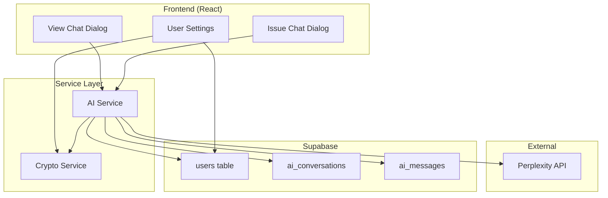

# Design Document: Perplexity Chat Integration

## Overview

This design extends Sloth.app's existing AI chat functionality to use per-user Perplexity API keys instead of a global key or per-project key. The existing `ai_conversations` and `ai_messages` tables already support chat history persistence. The main changes are:

1. Add encrypted API key storage to the users table
2. Create a crypto service for encryption/decryption
3. Update the AI service to use the user's API key
4. Add a settings UI for users to manage their API key

## Architecture



## Components and Interfaces

### 1. Crypto Service

New service for encrypting/decrypting sensitive data.

```typescript
// src/services/crypto/cryptoService.ts

/**
 * Encrypts a plaintext string using AES-256-GCM
 * Uses VITE_ENCRYPTION_KEY from environment
 * Returns format: iv:authTag:ciphertext (base64 encoded)
 */
export function encrypt(plaintext: string): string;

/**
 * Decrypts a ciphertext string encrypted with encrypt()
 * Returns the original plaintext
 */
export function decrypt(ciphertext: string): string;
```

### 2. User API Key Service

New service for managing user Perplexity API keys.

```typescript
// src/services/perplexity/userApiKeyService.ts

export type ApiKeyError =
  | "USER_NOT_FOUND"
  | "INVALID_API_KEY"
  | "ENCRYPTION_ERROR"
  | "UNKNOWN_ERROR";

export interface ApiKeyResponse<T> {
  success: boolean;
  data?: T;
  error?: ApiKeyError;
  message?: string;
}

/**
 * Saves or updates a user's Perplexity API key (encrypted)
 */
export async function saveUserApiKey(
  userId: string,
  apiKey: string
): Promise<ApiKeyResponse<void>>;

/**
 * Gets the API key status for a user (does not return the actual key)
 */
export async function getUserApiKeyStatus(
  userId: string
): Promise<ApiKeyResponse<{ hasApiKey: boolean }>>;

/**
 * Gets the decrypted API key for a user (internal use only)
 */
export async function getDecryptedApiKey(
  userId: string
): Promise<string | null>;

/**
 * Removes a user's API key
 */
export async function removeUserApiKey(
  userId: string
): Promise<ApiKeyResponse<void>>;
```

### 3. Updated AI Service

Modify existing AI service to use per-user API keys.

```typescript
// src/services/ai/aiService.ts (modifications)

/**
 * Gets Perplexity client using the user's API key
 * Falls back to VITE_PERPLEXITY_API_KEY if user has no key
 */
async function getPerplexityClientForUser(
  userId: string
): Promise<Perplexity | null>;

/**
 * Updated chat function that accepts userId
 */
export async function chat(
  messages: ChatMessage[],
  model: AIModel,
  systemPrompt: string,
  userId: string
): Promise<AIResponse<ChatResponse>>;

/**
 * Updated sendMessage that uses user's API key
 */
export async function sendMessage(
  contextType: AIContextType,
  contextId: string,
  userMessage: string,
  userId: string
): Promise<AIResponse<{ userMessage: AIMessage; aiResponse: AIMessage }>>;
```

### 4. Perplexity Settings Component

New component for user settings page.

```typescript
// src/components/settings/PerplexitySettings.tsx

interface PerplexitySettingsProps {
  userId: string;
}

/**
 * Displays:
 * - Current API key status (Configured / Not configured)
 * - Password input for new API key
 * - Save button
 * - Remove button (if key exists)
 */
export function PerplexitySettings({
  userId,
}: PerplexitySettingsProps): JSX.Element;
```

## Data Models

### Database Schema Changes

```sql
-- Add encrypted API key column to users table
ALTER TABLE users ADD COLUMN perplexity_api_key_enc TEXT;
```

### TypeScript Type Updates

```typescript
// src/db/types.ts - Update users table type
users: {
  Row: {
    id: string;
    email: string;
    wallet_address: string;
    perplexity_api_key_enc: string | null; // NEW
    created_at: string;
    updated_at: string;
  }
  // ... Insert and Update types also updated
}

// src/types/auth.ts - User type doesn't expose the key
export interface User {
  id: string;
  email: string;
  walletAddress: string;
  hasPerplexityApiKey?: boolean; // NEW - derived field
  createdAt: Date;
  updatedAt: Date;
}
```

### Environment Variables

```env
# New encryption key for API key storage
VITE_ENCRYPTION_KEY=your-32-byte-hex-key-here
```

## Correctness Properties

_A property is a characteristic or behavior that should hold true across all valid executions of a system-essentially, a formal statement about what the system should do. Properties serve as the bridge between human-readable specifications and machine-verifiable correctness guarantees._

### Property 1: Encryption Round-Trip

_For any_ plaintext API key, encrypting it and then decrypting the result should produce the original plaintext.

**Validates: Requirements 1.2**

### Property 2: API Key Never Exposed

_For any_ API response or error message from the system, the decrypted API key value should never appear in the response body, headers, or error details.

**Validates: Requirements 1.4, 6.3**

### Property 3: API Key Status Returns Boolean Only

_For any_ call to getUserApiKeyStatus, the response should contain only a boolean `hasApiKey` field and never the actual key value.

**Validates: Requirements 1.6**

### Property 4: API Key Update Replaces Existing

_For any_ user with an existing API key, saving a new API key should result in the new key being stored (verifiable by decryption) and the old key being inaccessible.

**Validates: Requirements 1.5**

### Property 5: Chat History Loaded Before Send

_For any_ message sent in a view or issue context, the system should load all existing messages for that context before calling the Perplexity API.

**Validates: Requirements 2.2, 3.2**

### Property 6: API Called With Full History

_For any_ message sent, the Perplexity API should be called with a messages array containing all previous messages in the conversation plus the new user message.

**Validates: Requirements 2.3, 3.3**

### Property 7: Both Messages Persisted

_For any_ successful Perplexity API response, both the user message and the assistant reply should be saved to the database with correct roles.

**Validates: Requirements 2.4, 3.4**

### Property 8: No API Key Shows Prompt

_For any_ user without a configured API key attempting to use chat, the system should return an error indicating they need to configure their API key.

**Validates: Requirements 2.6, 3.6**

### Property 9: API Errors Return User-Friendly Message

_For any_ Perplexity API error, the system should return a user-friendly error message (not raw API error details).

**Validates: Requirements 2.7, 3.7, 5.4**

### Property 10: Messages Persisted With Required Fields

_For any_ saved chat message, it should have a valid role (user/assistant/system), non-empty content, and a timestamp.

**Validates: Requirements 4.1**

### Property 11: Chat History Isolation

_For any_ two different contexts (different views or issues), their chat messages should be completely isolated - loading history for one should not include messages from the other.

**Validates: Requirements 4.3**

### Property 12: Clear Removes All Messages

_For any_ context with existing messages, calling clearConversation should result in zero messages remaining for that context.

**Validates: Requirements 4.4**

### Property 13: User API Key Used For Auth

_For any_ Perplexity API call made on behalf of a user with a configured API key, the request should use that user's decrypted key for authentication.

**Validates: Requirements 5.2**

## Error Handling

| Error Scenario                 | Error Code        | User Message                                                                  |
| ------------------------------ | ----------------- | ----------------------------------------------------------------------------- |
| User has no API key            | NO_API_KEY        | "Please configure your Perplexity API key in settings."                       |
| Invalid API key                | INVALID_API_KEY   | "Your Perplexity API key is invalid. Please check and update it in settings." |
| Perplexity API rate limit      | RATE_LIMIT        | "Please wait a moment before sending another message."                        |
| Perplexity API error           | API_ERROR         | "AI assistant is temporarily unavailable. Please try again."                  |
| Context (view/issue) not found | CONTEXT_NOT_FOUND | "The view/issue could not be found."                                          |
| Empty message                  | INVALID_MESSAGE   | "Message content is required."                                                |
| Encryption failure             | ENCRYPTION_ERROR  | "Failed to securely store your API key. Please try again."                    |

## Testing Strategy

### Unit Tests

- Crypto service: Test encrypt/decrypt round-trip with various inputs
- User API key service: Test save, get status, remove operations
- AI service: Test message formatting, error handling

### Property-Based Tests

Using a property-based testing library (e.g., fast-check), implement tests for:

1. **Property 1**: Generate random strings, verify encrypt→decrypt round-trip
2. **Property 11**: Generate random contexts and messages, verify isolation
3. **Property 12**: Generate contexts with messages, verify clear removes all

### Integration Tests

- End-to-end chat flow: Save API key → Send message → Verify response saved
- Error scenarios: Test with invalid API key, missing key, API errors

### Test Configuration

- Property tests: Minimum 100 iterations per property
- Each property test tagged with: **Feature: perplexity-chat-integration, Property N: {property_text}**
