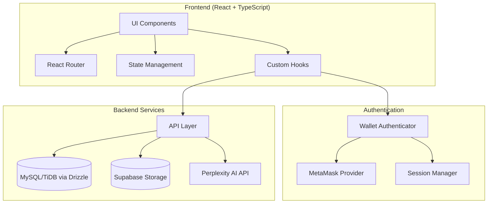

# Design Document: Sloth.app - The Momentum Tracker

## Overview

Sloth.app is a minimalist, keyboard-first personal project management application built with React, TypeScript, and TailwindCSS. It features web3 authentication via MetaMask, AI-assisted planning via Perplexity AI, and file storage via Supabase. The application follows a strict hierarchical data model: Project > View > Issue.

The architecture prioritizes:

- **Speed**: Optimistic UI updates, efficient data fetching
- **Simplicity**: Clean component hierarchy matching the data model
- **Security**: Wallet-based authentication with message signing
- **Extensibility**: Modular AI and storage integrations

## Architecture



### Layer Responsibilities

1. **UI Layer**: React components with TailwindCSS styling, dark mode only
2. **Routing Layer**: React Router for navigation (/dashboard, /project/:id, /view/:id, /issue/:id)
3. **State Layer**: React Context + hooks for local state, server state via React Query
4. **Authentication Layer**: wagmi for MetaMask integration, custom session management
5. **API Layer**: REST endpoints for CRUD operations, AI chat, file uploads
6. **Data Layer**: Drizzle ORM with MySQL/TiDB, Supabase for file storage

## Components and Interfaces

### Core UI Components

```typescript
// Layout Components
interface AppLayoutProps {
  children: React.ReactNode;
}

interface SidebarProps {
  projects: Project[];
  activeProjectId?: string;
  onCreateProject: () => void;
}

interface CommandPaletteProps {
  isOpen: boolean;
  onClose: () => void;
  commands: Command[];
}

// Project Components
interface ProjectListProps {
  projects: Project[];
  onSelect: (projectId: string) => void;
}

interface ProjectDetailProps {
  project: Project;
  views: View[];
  onCreateView: () => void;
  onInviteCollaborator: (email: string) => void;
  onCopyProject: () => void;
}

// View Components
interface ViewWorkspaceProps {
  view: View;
  issues: Issue[];
  onCreateIssue: () => void;
}

interface ViewContextSidebarProps {
  viewId: string;
  documents: Document[];
  links: Link[];
  onUploadDocument: (file: File) => void;
  onAddLink: (url: string, description: string) => void;
}

interface AIChatBoxProps {
  contextType: "view" | "issue";
  contextId: string;
  model: "sonar-deep-research" | "sonar-pro";
  systemPrompt: string;
}

// Issue Components
interface IssueListProps {
  issues: Issue[];
  onSelect: (issueId: string) => void;
}

interface IssueDetailProps {
  issue: Issue;
  subIssues: Issue[];
  comments: Comment[];
  documents: Document[];
  links: Link[];
}

interface CommentBoxProps {
  issueId: string;
  comments: Comment[];
  onAddComment: (content: string, parentId?: string) => void;
}
```

### Authentication Components

```typescript
interface WalletConnectButtonProps {
  onConnect: (address: string) => void;
  onError: (error: Error) => void;
}

interface SignupFormProps {
  onSubmit: (email: string, walletAddress: string, signature: string) => void;
}

interface LoginFormProps {
  onWalletLogin: (walletAddress: string) => void;
}
```

### Service Interfaces

```typescript
// Authentication Service
interface AuthService {
  signup(
    email: string,
    walletAddress: string,
    signature: string
  ): Promise<User>;
  loginWithWallet(walletAddress: string): Promise<User>;
  logout(): Promise<void>;
  getCurrentUser(): Promise<User | null>;
  verifyWalletSignature(
    address: string,
    message: string,
    signature: string
  ): boolean;
}

// Project Service
interface ProjectService {
  getProjects(userId: string): Promise<Project[]>;
  getProject(projectId: string): Promise<Project>;
  createProject(name: string, ownerId: string): Promise<Project>;
  copyProject(projectId: string): Promise<Project>;
  inviteCollaborator(projectId: string, email: string): Promise<Invitation>;
  getCollaborators(projectId: string): Promise<User[]>;
}

// View Service
interface ViewService {
  getViews(projectId: string): Promise<View[]>;
  getView(viewId: string): Promise<View>;
  createView(projectId: string, name: string, tag: string): Promise<View>;
  updateView(viewId: string, updates: Partial<View>): Promise<View>;
  deleteView(viewId: string): Promise<void>;
}

// Issue Service
interface IssueService {
  getIssues(viewId: string): Promise<Issue[]>;
  getIssue(issueId: string): Promise<Issue>;
  createIssue(
    viewId: string,
    name: string,
    description: string
  ): Promise<Issue>;
  createSubIssue(
    parentId: string,
    name: string,
    description: string
  ): Promise<Issue>;
  updateIssue(issueId: string, updates: Partial<Issue>): Promise<Issue>;
  deleteIssue(issueId: string): Promise<void>;
}

// Comment Service
interface CommentService {
  getComments(issueId: string): Promise<Comment[]>;
  addComment(
    issueId: string,
    content: string,
    parentId?: string
  ): Promise<Comment>;
  deleteComment(commentId: string): Promise<void>;
}

// Document Service
interface DocumentService {
  uploadDocument(
    file: File,
    contextType: "view" | "issue",
    contextId: string
  ): Promise<Document>;
  getDocuments(
    contextType: "view" | "issue",
    contextId: string
  ): Promise<Document[]>;
  deleteDocument(documentId: string): Promise<void>;
  getDownloadUrl(documentId: string): Promise<string>;
}

// Link Service
interface LinkService {
  addLink(
    url: string,
    description: string,
    contextType: "view" | "issue",
    contextId: string
  ): Promise<Link>;
  getLinks(contextType: "view" | "issue", contextId: string): Promise<Link[]>;
  deleteLink(linkId: string): Promise<void>;
}

// AI Service
interface AIService {
  chat(
    messages: ChatMessage[],
    model: "sonar-deep-research" | "sonar-pro",
    systemPrompt: string
  ): Promise<ChatResponse>;
  getConversationHistory(
    contextType: "view" | "issue",
    contextId: string
  ): Promise<ChatMessage[]>;
  saveMessage(
    contextType: "view" | "issue",
    contextId: string,
    message: ChatMessage
  ): Promise<void>;
}
```

## Data Models

### Database Schema (Drizzle ORM)

```typescript
// Users table
const users = pgTable("users", {
  id: uuid("id").primaryKey().defaultRandom(),
  email: varchar("email", { length: 255 }).notNull().unique(),
  walletAddress: varchar("wallet_address", { length: 42 }).notNull().unique(),
  createdAt: timestamp("created_at").defaultNow().notNull(),
  updatedAt: timestamp("updated_at").defaultNow().notNull(),
});

// Projects table
const projects = pgTable("projects", {
  id: uuid("id").primaryKey().defaultRandom(),
  name: varchar("name", { length: 255 }).notNull(),
  ownerId: uuid("owner_id")
    .references(() => users.id)
    .notNull(),
  createdAt: timestamp("created_at").defaultNow().notNull(),
  updatedAt: timestamp("updated_at").defaultNow().notNull(),
});

// Project Collaborators (many-to-many)
const projectCollaborators = pgTable("project_collaborators", {
  id: uuid("id").primaryKey().defaultRandom(),
  projectId: uuid("project_id")
    .references(() => projects.id)
    .notNull(),
  userId: uuid("user_id")
    .references(() => users.id)
    .notNull(),
  role: varchar("role", { length: 50 }).default("collaborator").notNull(),
  invitedAt: timestamp("invited_at").defaultNow().notNull(),
  acceptedAt: timestamp("accepted_at"),
});

// Invitations table
const invitations = pgTable("invitations", {
  id: uuid("id").primaryKey().defaultRandom(),
  projectId: uuid("project_id")
    .references(() => projects.id)
    .notNull(),
  email: varchar("email", { length: 255 }).notNull(),
  invitedBy: uuid("invited_by")
    .references(() => users.id)
    .notNull(),
  status: varchar("status", { length: 20 }).default("pending").notNull(),
  createdAt: timestamp("created_at").defaultNow().notNull(),
  expiresAt: timestamp("expires_at").notNull(),
});

// Views table
const views = pgTable("views", {
  id: uuid("id").primaryKey().defaultRandom(),
  projectId: uuid("project_id")
    .references(() => projects.id)
    .notNull(),
  name: varchar("name", { length: 255 }).notNull(),
  tag: varchar("tag", { length: 10 }).notNull(),
  createdAt: timestamp("created_at").defaultNow().notNull(),
  updatedAt: timestamp("updated_at").defaultNow().notNull(),
});

// Issues table
const issues = pgTable("issues", {
  id: uuid("id").primaryKey().defaultRandom(),
  viewId: uuid("view_id")
    .references(() => views.id)
    .notNull(),
  parentId: uuid("parent_id").references(() => issues.id),
  name: varchar("name", { length: 255 }).notNull(),
  description: text("description"),
  createdBy: uuid("created_by")
    .references(() => users.id)
    .notNull(),
  createdAt: timestamp("created_at").defaultNow().notNull(),
  updatedAt: timestamp("updated_at").defaultNow().notNull(),
});

// Comments table
const comments = pgTable("comments", {
  id: uuid("id").primaryKey().defaultRandom(),
  issueId: uuid("issue_id")
    .references(() => issues.id)
    .notNull(),
  parentId: uuid("parent_id").references(() => comments.id),
  authorId: uuid("author_id")
    .references(() => users.id)
    .notNull(),
  content: text("content").notNull(),
  createdAt: timestamp("created_at").defaultNow().notNull(),
  updatedAt: timestamp("updated_at").defaultNow().notNull(),
});

// Documents table
const documents = pgTable("documents", {
  id: uuid("id").primaryKey().defaultRandom(),
  contextType: varchar("context_type", { length: 10 }).notNull(), // 'view' | 'issue'
  contextId: uuid("context_id").notNull(),
  fileName: varchar("file_name", { length: 255 }).notNull(),
  fileType: varchar("file_type", { length: 100 }).notNull(),
  fileSize: integer("file_size").notNull(),
  storagePath: varchar("storage_path", { length: 500 }).notNull(),
  uploadedBy: uuid("uploaded_by")
    .references(() => users.id)
    .notNull(),
  createdAt: timestamp("created_at").defaultNow().notNull(),
});

// Links table
const links = pgTable("links", {
  id: uuid("id").primaryKey().defaultRandom(),
  contextType: varchar("context_type", { length: 10 }).notNull(), // 'view' | 'issue'
  contextId: uuid("context_id").notNull(),
  url: varchar("url", { length: 2000 }).notNull(),
  description: varchar("description", { length: 500 }),
  createdBy: uuid("created_by")
    .references(() => users.id)
    .notNull(),
  createdAt: timestamp("created_at").defaultNow().notNull(),
});

// AI Conversations table
const aiConversations = pgTable("ai_conversations", {
  id: uuid("id").primaryKey().defaultRandom(),
  contextType: varchar("context_type", { length: 10 }).notNull(), // 'view' | 'issue'
  contextId: uuid("context_id").notNull(),
  createdAt: timestamp("created_at").defaultNow().notNull(),
});

// AI Messages table
const aiMessages = pgTable("ai_messages", {
  id: uuid("id").primaryKey().defaultRandom(),
  conversationId: uuid("conversation_id")
    .references(() => aiConversations.id)
    .notNull(),
  role: varchar("role", { length: 20 }).notNull(), // 'user' | 'assistant'
  content: text("content").notNull(),
  createdAt: timestamp("created_at").defaultNow().notNull(),
});
```

### TypeScript Types

```typescript
interface User {
  id: string;
  email: string;
  walletAddress: string;
  createdAt: Date;
  updatedAt: Date;
}

interface Project {
  id: string;
  name: string;
  ownerId: string;
  createdAt: Date;
  updatedAt: Date;
}

interface View {
  id: string;
  projectId: string;
  name: string;
  tag: string;
  createdAt: Date;
  updatedAt: Date;
}

interface Issue {
  id: string;
  viewId: string;
  parentId: string | null;
  name: string;
  description: string | null;
  createdBy: string;
  createdAt: Date;
  updatedAt: Date;
}

interface Comment {
  id: string;
  issueId: string;
  parentId: string | null;
  authorId: string;
  content: string;
  createdAt: Date;
  updatedAt: Date;
}

interface Document {
  id: string;
  contextType: "view" | "issue";
  contextId: string;
  fileName: string;
  fileType: string;
  fileSize: number;
  storagePath: string;
  uploadedBy: string;
  createdAt: Date;
}

interface Link {
  id: string;
  contextType: "view" | "issue";
  contextId: string;
  url: string;
  description: string | null;
  createdBy: string;
  createdAt: Date;
}

interface ChatMessage {
  id: string;
  role: "user" | "assistant";
  content: string;
  createdAt: Date;
}

interface Invitation {
  id: string;
  projectId: string;
  email: string;
  invitedBy: string;
  status: "pending" | "accepted" | "expired";
  createdAt: Date;
  expiresAt: Date;
}

interface Command {
  id: string;
  label: string;
  shortcut?: string;
  action: () => void;
  context?: "global" | "dashboard" | "project" | "view" | "issue";
}
```

## Correctness Properties

_A property is a characteristic or behavior that should hold true across all valid executions of a system—essentially, a formal statement about what the system should do. Properties serve as the bridge between human-readable specifications and machine-verifiable correctness guarantees._

### Property 1: Email-Wallet Linking Persistence

_For any_ valid email and wallet address pair, after successful signup, querying the database with either the email or wallet address should return the linked user record with both values correctly associated.

**Validates: Requirements 1.3**

### Property 2: Duplicate Wallet Prevention

_For any_ wallet address already registered in the system, attempting to register with a different email should fail with an appropriate error, and the original email-wallet link should remain unchanged.

**Validates: Requirements 1.4**

### Property 3: Wallet Authentication Consistency

_For any_ registered wallet address, wallet verification should succeed and return the correct user. _For any_ unregistered wallet address, verification should fail and indicate the user needs to sign up.

**Validates: Requirements 2.2, 2.3**

### Property 4: Session Establishment

_For any_ successful authentication (signup or login), a valid session should be established, and subsequent requests with that session should be authenticated as the correct user.

**Validates: Requirements 2.5**

### Property 5: User Projects Display Completeness

_For any_ authenticated user with N projects (owned or collaborated), the dashboard should display exactly N projects, and each project should be accessible from both the sidebar and main content area.

**Validates: Requirements 3.1, 3.3**

### Property 6: Project Creation Round-Trip

_For any_ valid project name, creating a project should result in a project that can be retrieved with the same name, correct owner, and appears in the user's project list.

**Validates: Requirements 4.2**

### Property 7: Project Navigation Consistency

_For any_ project in a user's list, selecting that project should navigate to /project/:id where :id matches the project's ID, and the project detail view should display the correct project data.

**Validates: Requirements 4.3**

### Property 8: Invitation Creation

_For any_ valid email address and project, creating an invitation should result in a retrievable invitation record with pending status, correct project ID, and correct inviter.

**Validates: Requirements 4.4, 5.2**

### Property 9: Project Copy Structure Preservation

_For any_ project with N views (each with tags), copying the project should create a new project with exactly N views with identical names and tags, but zero issues in any view.

**Validates: Requirements 4.5**

### Property 10: Invitation Acceptance Grants Access

_For any_ pending invitation that is accepted, the invited user should gain access to the project and appear in the project's collaborator list.

**Validates: Requirements 5.3**

### Property 11: View Display in Project

_For any_ project with N views, opening the project should display exactly N views, each with its correct name and tag.

**Validates: Requirements 6.1**

### Property 12: View Creation Validation

_For any_ view creation attempt, if either name or tag is empty/missing, the creation should fail. If both are provided, the view should be created successfully.

**Validates: Requirements 6.2**

### Property 13: View Creation Round-Trip

_For any_ valid view name and tag within a project, creating a view should result in a view that can be retrieved with the same name and tag, and appears in the project's view list.

**Validates: Requirements 6.3**

### Property 14: Issue Display in View

_For any_ view with N issues (excluding sub-issues), opening the view should display exactly N top-level issues in the central area.

**Validates: Requirements 7.1**

### Property 15: Issue Creation Validation

_For any_ issue creation attempt, if name is empty/missing, the creation should fail. If name is provided, the issue should be created successfully.

**Validates: Requirements 7.3**

### Property 16: Issue Creation Round-Trip

_For any_ valid issue name and description within a view, creating an issue should result in an issue that can be retrieved with the same name and description, and appears in the view's issue list.

**Validates: Requirements 7.4**

### Property 17: View-Level Document Storage Round-Trip

_For any_ file uploaded to a view, the file should be stored in Supabase and retrievable by any project collaborator with the correct filename, type, and content.

**Validates: Requirements 8.3**

### Property 18: AI Response Display

_For any_ message sent to the AI assistant (in either view or issue context), when a response is received, it should be displayed in the chat interface and persisted in the conversation history.

**Validates: Requirements 9.5, 12.5**

### Property 19: Issue Detail Display

_For any_ issue, clicking on it should display the issue detail view with the correct name, description, and all associated context (comments, documents, links).

**Validates: Requirements 10.1**

### Property 20: Sub-Issue Hierarchy

_For any_ parent issue, creating a sub-issue should result in an issue with parentId correctly set to the parent's ID, and the sub-issue should appear in the parent's sub-issue list.

**Validates: Requirements 10.3**

### Property 21: Comment Thread Integrity

_For any_ issue with N comments, all comments should be retrievable, displayed in chronological order, with correct author information. Replies should be correctly linked to their parent comments.

**Validates: Requirements 11.2, 11.3, 11.4**

### Property 22: Issue-Level Document Storage Round-Trip

_For any_ file uploaded to an issue, the file should be stored in Supabase linked to that specific issue and retrievable only in that issue's context.

**Validates: Requirements 13.2**

### Property 23: Link Storage Round-Trip

_For any_ link added to a view or issue, the link should be retrievable with the correct URL and description in the appropriate context.

**Validates: Requirements 13.4**

### Property 24: Command Palette Search

_For any_ command registered in the command palette, searching with a substring of the command label should include that command in the results, and executing it should trigger the associated action.

**Validates: Requirements 14.2**

## Error Handling

### Authentication Errors

| Error Condition               | Response             | User Feedback                                                  |
| ----------------------------- | -------------------- | -------------------------------------------------------------- |
| MetaMask not installed        | Prevent signup/login | Display installation instructions with link                    |
| Wallet connection rejected    | Abort auth flow      | "Wallet connection was cancelled. Please try again."           |
| Signature rejected            | Abort signup         | "Message signing was cancelled. Please try again."             |
| Duplicate wallet registration | Reject signup        | "This wallet is already linked to another account."            |
| Unregistered wallet login     | Redirect to signup   | "No account found. Please sign up first."                      |
| Invalid signature             | Reject auth          | "Signature verification failed. Please try again."             |
| Session expired               | Clear session        | Redirect to login with "Session expired. Please log in again." |

### Data Operation Errors

| Error Condition                 | Response         | User Feedback                                         |
| ------------------------------- | ---------------- | ----------------------------------------------------- |
| Project not found               | 404 response     | "Project not found or you don't have access."         |
| View not found                  | 404 response     | "View not found."                                     |
| Issue not found                 | 404 response     | "Issue not found."                                    |
| Unauthorized access             | 403 response     | "You don't have permission to access this resource."  |
| Invalid project name            | Validation error | "Project name is required."                           |
| Invalid view (missing name/tag) | Validation error | "View name and tag are required."                     |
| Invalid issue (missing name)    | Validation error | "Issue name is required."                             |
| Duplicate view tag in project   | Validation error | "A view with this tag already exists in the project." |

### File Upload Errors

| Error Condition         | Response      | User Feedback                                                 |
| ----------------------- | ------------- | ------------------------------------------------------------- |
| File too large          | Reject upload | "File exceeds maximum size of 50MB."                          |
| Invalid file type       | Reject upload | "File type not supported. Allowed: PDF, Office docs, Images." |
| Supabase upload failure | Retry or fail | "Upload failed. Please try again."                            |
| Storage quota exceeded  | Reject upload | "Storage quota exceeded. Please delete some files."           |

### AI Integration Errors

| Error Condition            | Response             | User Feedback                                             |
| -------------------------- | -------------------- | --------------------------------------------------------- |
| Perplexity API unavailable | Graceful degradation | "AI assistant is temporarily unavailable."                |
| API rate limit exceeded    | Queue or delay       | "Please wait a moment before sending another message."    |
| Invalid API key            | Log error            | "AI service configuration error. Please contact support." |
| Response timeout           | Retry once           | "Response is taking longer than expected. Retrying..."    |

### Invitation Errors

| Error Condition        | Response          | User Feedback                                            |
| ---------------------- | ----------------- | -------------------------------------------------------- |
| Invalid email format   | Validation error  | "Please enter a valid email address."                    |
| Self-invitation        | Reject            | "You cannot invite yourself to a project."               |
| Already a collaborator | Reject            | "This user is already a collaborator on this project."   |
| Invitation expired     | Reject acceptance | "This invitation has expired. Please request a new one." |

## Testing Strategy

### Testing Framework

- **Unit Testing**: Vitest for fast, TypeScript-native unit tests
- **Property-Based Testing**: fast-check for generating random inputs and testing properties
- **Integration Testing**: Vitest with MSW (Mock Service Worker) for API mocking
- **E2E Testing**: Playwright for browser-based end-to-end tests

### Unit Tests

Unit tests focus on specific examples and edge cases:

- **Authentication**: Test wallet signature verification, session management
- **Data Validation**: Test input validation for projects, views, issues, comments
- **Service Functions**: Test individual service methods with mocked dependencies
- **UI Components**: Test component rendering and user interactions

### Property-Based Tests

Each correctness property will be implemented as a property-based test using fast-check:

```typescript
// Example: Property 6 - Project Creation Round-Trip
import { fc } from "fast-check";

// Feature: sloth-app, Property 6: Project Creation Round-Trip
// Validates: Requirements 4.2
test("project creation round-trip", () => {
  fc.assert(
    fc.property(
      fc.string({ minLength: 1, maxLength: 255 }), // valid project name
      fc.uuid(), // user ID
      async (name, userId) => {
        const created = await projectService.createProject(name, userId);
        const retrieved = await projectService.getProject(created.id);

        expect(retrieved.name).toBe(name);
        expect(retrieved.ownerId).toBe(userId);
      }
    ),
    { numRuns: 100 }
  );
});
```

### Test Configuration

- Minimum 100 iterations per property test
- Each property test tagged with: `Feature: sloth-app, Property {N}: {title}`
- Tests co-located with source files using `.test.ts` suffix
- Separate integration test files in `__tests__` directories

### Test Coverage Goals

| Category            | Target Coverage |
| ------------------- | --------------- |
| Core Services       | 90%+            |
| Data Validation     | 100%            |
| Authentication Flow | 95%+            |
| UI Components       | 80%+            |
| API Endpoints       | 90%+            |

### Dual Testing Approach

- **Unit tests**: Verify specific examples, edge cases, error conditions
- **Property tests**: Verify universal properties across all valid inputs
- Both are complementary—unit tests catch concrete bugs, property tests verify general correctness
